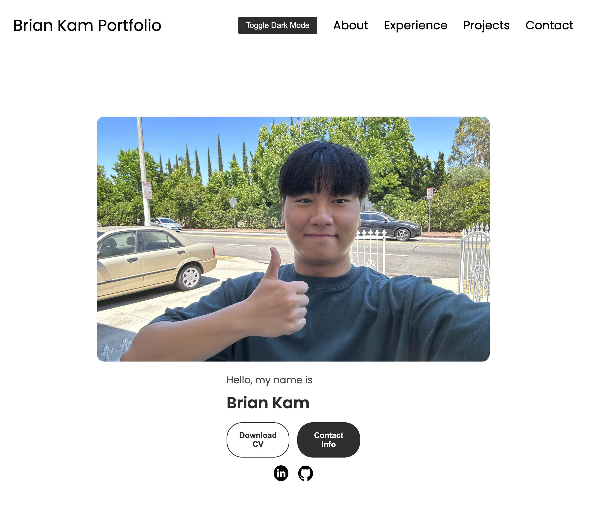

# dhkam1102.github.io

# Brian Kam's Portfolio

Welcome to my personal portfolio website! This site showcases my skills, experience, projects, and ways to get in touch with me.

## Introduction

This is my personal portfolio website built to showcase my professional background, skills, projects, and personal interests. The site is responsive and includes both light and dark modes.

## Features

- **Responsive Design**: Adjusts to different screen sizes for an optimal viewing experience on all devices.
- **Dark Mode**: Toggle between light and dark themes for a comfortable viewing experience.
- **Profile Section**: Introduction and professional summary.
- **Skills Section**: Overview of programming languages and tools I am proficient in.
- **Contact Section**: Contact information and social media links.

## Technologies Used

- **HTML**: Markup language for creating the structure of the website.
- **CSS**: Styling the website, including custom styles and media queries for responsiveness.
- **JavaScript**: Adding interactivity and handling theme toggling.

## Usage

- **Dark Mode Toggle**: Click the "Toggle Dark Mode" button to switch between light and dark themes.
- **Navigation**: Use the top navigation bar to quickly jump to different sections of the site. On smaller screens, use the hamburger menu.
- **Contact**: Click on the email or LinkedIn icon in the contact section to get in touch with me.

## Contact

Feel free to reach out to me via email or connect with me on LinkedIn.

- **Email**: [brianhyunkam@gmail.com](mailto:brianhyunkam@gmail.com)
- **LinkedIn**: [Brian Kam](https://www.linkedin.com/in/brian-kam-297144277/)

Thank you for visiting my portfolio!
